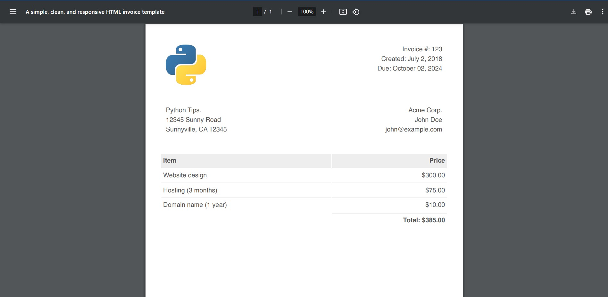

# Invoice-Generator

This is a great project to learn how to simply render a pdf to a client
using Python's Flask microframework.

  - [Built with](#built-with)
  - [What I learned](#what-i-learned)
  - [Useful resources](#useful-resources)

  
### Built with
- 
- 
- 

  
### What I learned
##### Installation on Linux
The most important thing I learned was how to install the **weasyprint** python's module on a
Windows OS. That quickly becomes a challenge, when you have separated the different disk, and you
doesn't install all your applications on the local C.

With Linux, the installation of the different packages is much simpler. So, If you can use it, work on
Linux for this project.

  
##### Flask render_template() method
- I've also learned that render_template returns a beautiful object with some pretty well built
methods. It doesn't just render a webpage template!

  
### Useful resources
- [Python based project](https://practicalpython.yasoob.me/chapter3)
- [weasyprint installation on Windows](https://stackoverflow.com/questions/63449770/oserror-cannot-load-library-gobject-2-0-error-0x7e)
- [weasyprint troubleshooting](https://doc.courtbouillon.org/weasyprint/stable/first_steps.html#troubleshooting)